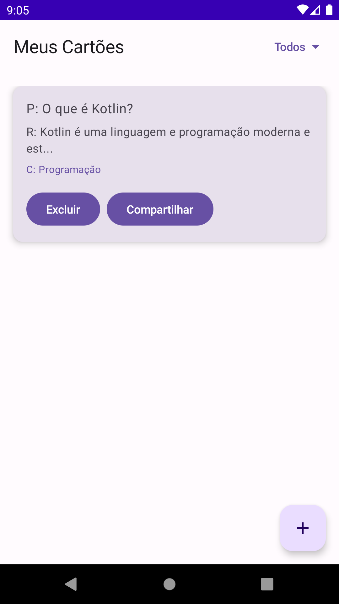
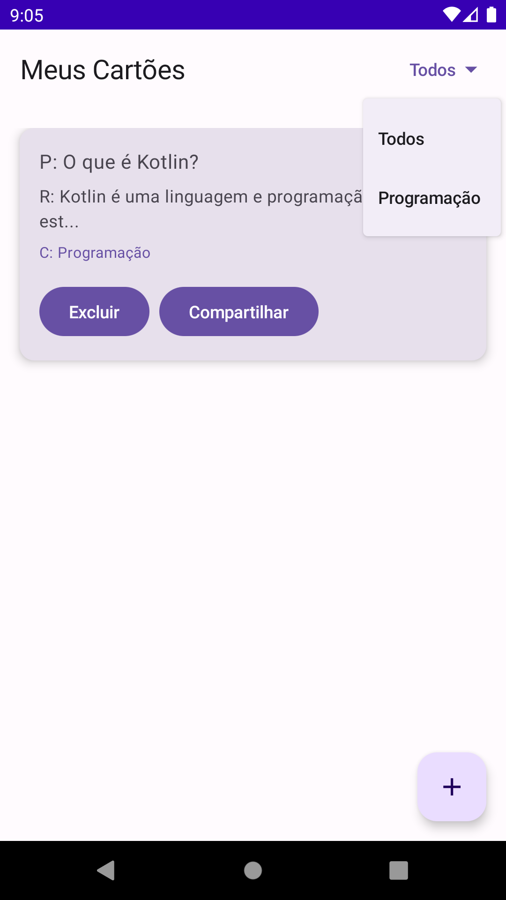
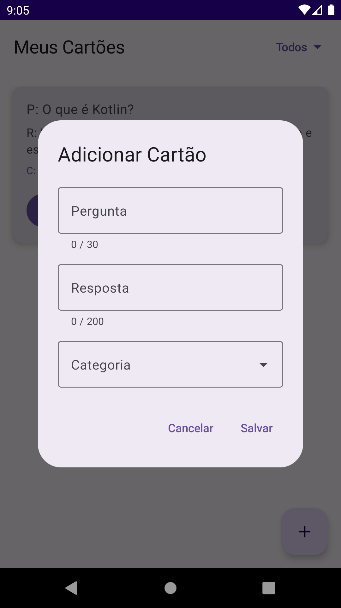
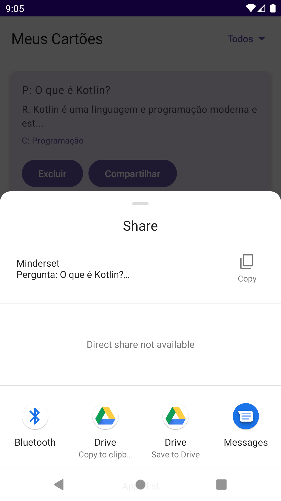

# 📚 Minderset App


**Potencialize sua jornada no desenvolvimento de software — um cartão de estudo por vez.**  
O Minderset é um app Android moderno que ajuda desenvolvedores a aprender e reter boas práticas de desenvolvimento de software por meio de cartões de estudo personalizados e categorizados.

---

## ✨ Funcionalidades

* 🧠 Crie e gerencie cartões de estudo personalizados
* 📂 Organize seu conhecimento em categorias personalizadas
* 📈 Acompanhe seu progresso e marque cartões como concluídos (a ser implementado)
* 🔗 Compartilhe seu conteúdo de estudo via apps externos  

---

## 🧑‍💻 Tecnologias

| Ferramenta / Biblioteca | Finalidade                  |
| ----------------------- | --------------------------- |
| **Kotlin**              | Linguagem de programação    |
| **Jetpack Compose**     | Toolkit moderno para UI     |
| **Room**                | Banco de dados local        |
| **Koin**                | Injeção de dependência      |
| **Coroutines**          | Programação assíncrona      |
| **JUnit, MockK**        | Testes unitários            |
| **Espresso**            | Testes de interface         |
| **Gradle (KTS)**        | Sistema de build            |

---

## 🚀 Começando

### Pré-requisitos

* Android Studio  
* Kotlin 1.8+
* Android SDK 34  

### Clonar e Buildar

```bash
git clone https://github.com/yourusername/minderset.git
cd minderset
./gradlew build
```
Ou abra o projeto no Android Studio e sincronize.

## 📱 Capturas de Tela / Demo

<table style="margin: auto; border-collapse: separate; border-spacing: 12px 6px;">
  <tr>
    <td style="text-align: center;">
      
    </td>
    <td style="text-align: center;">
      
    </td>
  </tr>
  <tr>
    <td style="text-align: center;">
      
    </td>
    <td style="text-align: center;">
      
    </td>
  </tr>
</table>

## 🎯 Público-Alvo
O aplicativo Minderset é voltado para desenvolvedores de software de qualquer especialidade técnica e qualquer nível de experiência que queiram organizar seus estudos e acompanhar o progresso na aquisição de boas práticas de desenvolvimento.
